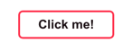
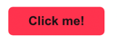
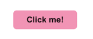
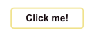
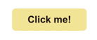
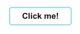
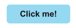
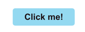
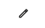

This is a library that provides one common component for the UI: a spring-themed button. 

By utilizing the below props, you can customize the behavior and look of your button!

A demo app can be found [here](https://github.com/NeniscaMaria/UI-Component-Demo-App/tree/master).
## Props for Button:

#### icon: element:
An icon to be shown in the button.

#### label: string or React node:
  The label to be rendered on the button. It can be string or another React component.

`Observation: If no label is supplied, but an icon is given, no out-of-the-box styling will be applied on the component.
However, the functionality that you will pass through the function props will be present.`

#### You can have multiple predefined sizes of the button by supplying on of the following props:
- small: boolean
- medium: boolean
- large: boolean

#### disabled: boolean 
  Specify if the button is disabled or not.

#### fill: boolean
   Specify if you want the button to be filled with color or not.
  
#### onClick: function: 
  Defines the behaviour on click.
  
#### onMouseDown: function
 Define the behaviour on mouseDown

#### onMouseUp: function
  Define the behaviour on mouseUp

#### onFocus: function
  Define the behaviour on focus

#### onBlur: function
  Define the behaviour on blur.

#### className: string: 
  Trough this prop, you can add additional styles to your button.
#### plain: boolean
  If true, will render a plain, simple button. 
  This will override any other out-of-the-box styling. So, if you pass other styling props together with `plain`, the result will still be a plain button.

#### reverse: boolean
  The label and icon are rendered depending on this prop.
  * true: label-icon
  * false: icon-label

#### This button offers the following pastel color scheme:
* primary #F194B4
* secondary #F1E494
* accent #94D9F1
* critical #FF324D

You can set each color by specifying one of these props:
- critical: boolean

 
- primary: boolean (this button option will be filled by default)

- secondary: boolean

  
- accent: boolean

  
#### type: string
 Specifies the type of the button. It can be one of: ["button", "reset", "submit"])
 
### Usage example
This creates a medium-sized button, filled with the accent color that has the text `Click me!` inside:

`<Button medium label={"Click me!"} accent fill />`

This creates a simple clickable icon:

`<Button medium icon={} />`

